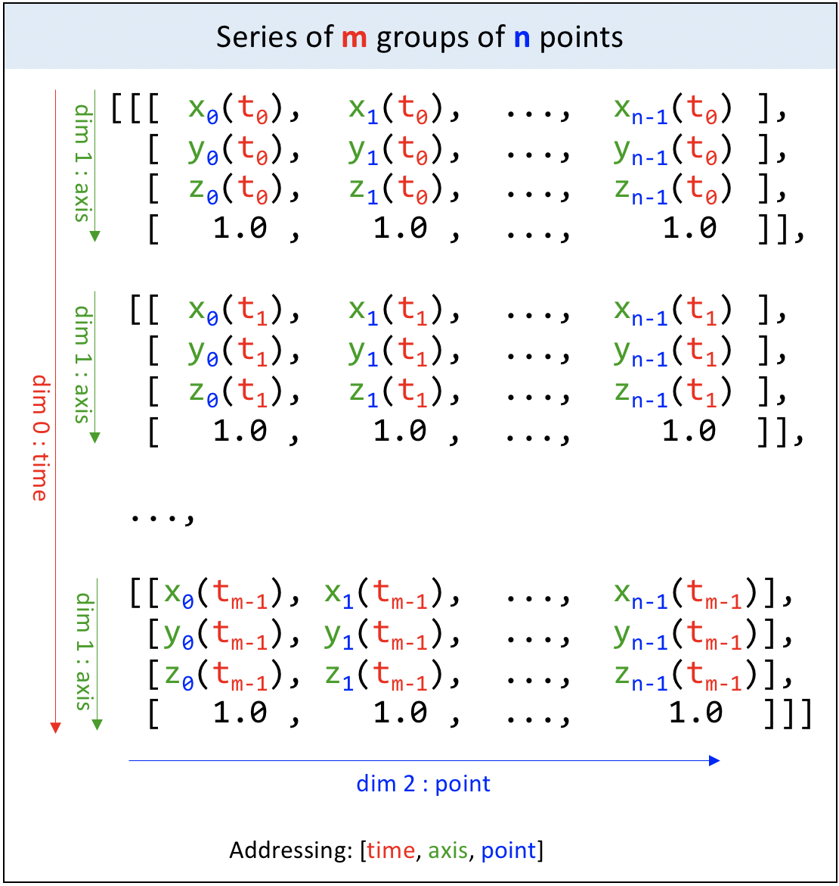

---
jupytext:
  text_representation:
    extension: .md
    format_name: myst
kernelspec:
  display_name: Python 3 (ipykernel)
  language: python
  name: python3
---

# Dimension conventions and first example

In the [geometry](/api/kineticstoolkit.geometry.rst) module and in most of Kinetics Toolkit's module:

- Every point, vector or matrix, and in many case even scalar, is considered as a **series**.
- The first dimension of any series corresponds to **time**.

To understand better how to express scalars, coordinates (points, vectors, frames) and homogeneous transforms as series, please refer to the following pictures:

## Series of scalars


## Series of points, series of vectors


## Series of groups of points, series of groups of vectors


 

## Series of frames/homogeneous transforms


## Working with constants

Since most signals in Kinetics Toolkit as considered as a series, always ensure that the first dimension of any array is reserved to time. For example, the vector (x = 1, y = 2, z = 3) must be expressed as `np.array([[1.0, 2.0, 3.0, 0.0]])` (note the double brackets). A common error would be to express it as `np.array([1.0, 2.0, 3.0, 0.0])` (single brackets), which would mean a series of 4 floats instead of one constant vector.

A quick way to convert a constant array to a series is to use numpy's `newaxis`:

```{code-cell}
import numpy as np

one_matrix = np.eye(4)
one_matrix
```

```{code-cell}
series_of_one_matrix = one_matrix[np.newaxis]
series_of_one_matrix
```

## First example with the geometry module

Now that we presented the conventions for expressing coordinates and transforms as series, we are ready to redo the last example from the last section, this time using Kinetics Toolkit.


Figure 1. Position and orientation of the humerus.

We know the lenght of the arm is 38 cm, and we want to express the position of the elbow in the global coordinate system. The shoulder is located 15 cm forward and 70 cm upward to the global origin and the humerus is inclined at 30 degrees of the vertical.

First, let's express the elbow position in the humerus coordinate system.

```{code-cell}
import kineticstoolkit.lab as ktk

local_elbow_position = np.array([[0, -0.38, 0, 1]])

local_elbow_position
```

Now, we create the frame representing the position and orientation of the humerus coordinate system. Since we know these position and orientation, then we will create this frame as an homogeneous transform from the global to the humerus coordinate system, using the [geometry.create_transforms()](/api/kineticstoolkit.geometry.create_transforms.rst) function:

```{code-cell}
humerus_frame = ktk.geometry.create_transforms(
    seq = 'z',
    angles = [np.deg2rad(30)],
    translations = [[0.15, 0.70, 0]])

humerus_frame
```

Now we can express the local elbow position in the global coordinate system:

```{code-cell}
ktk.geometry.get_global_coordinates(local_elbow_position, humerus_frame)
```
