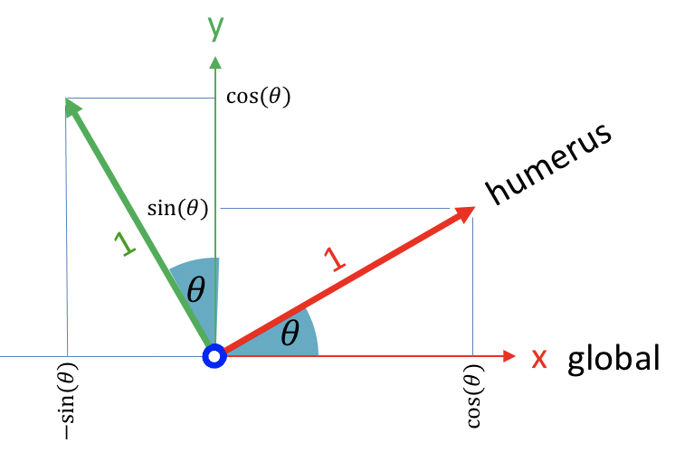

---
jupytext:
  text_representation:
    extension: .md
    format_name: myst
kernelspec:
  display_name: Python 3 (ipykernel)
  language: python
  name: python3
---

# Basics of rigid body geometry

This tutorial is an introduction or reminder of the basic elements of rigid body geometry. It covers the definitions of bodies, coordinate systems, coordinates (such as points, vectors and frames), and homogeneous transforms. It follows the nomenclature conventions of Craig, J., 1987. Introduction to robotics: Mechanics and control, in the context of rigid body biomechanics.

While these notions largely come from the robotics field, they will be approached in the scope of rigid body biomechanics. As such, we will use the posture in [Figure 1](humerus_intro) all through the tutorial as an example for every introduced notion. To facilitate the comprehension, this is a bidimensional example; however, we will treat it as conventional 3D problem, with all z coordinates being set to zero.

:::{figure-md} humerus_intro
:width: 200px

Figure 1. The posture used as an example in this tutorial.
:::

## Coordinates: points, vectors and frames

In this section, we will see how to express:

- Points (positions);
- Vectors such as velocities, accelerations and forces; and
- Frames, which are the orientation and position of a coordinate system.

### Global coordinate system

To express any coordinate, we need a coordinate system. A coordinate system is composed of an origin (the point in space everything is expressed relative to) and a set of axes. In human movement biomechanics, we usually use a cartesian system composed of three orthonormal axes (x, y and z).

In newton dynamics and at the human scale, it is totally acceptable to define a global, non-moving coordinate system everything can be referenced to. In [Figure 2](humerus_global_coordinates), we define such a fixed system:

- The origin is approximately at the hip level and posterior to the person;
- The x axis points forward;
- The y axis points upward;
- The z axis points to the right.

This coordinate system is completely arbitrary: any other origin or set of orthonormal axes would still be perfectly valid. This is the one we chose here, and the one every global coordinate will refer to.

:::{figure-md} humerus_global_coordinates
:width: 200px

Figure 2. A global coordinate system
:::

### Points and vectors

Using the global coordinate system of [Figure 2](humerus_global_coordinates), we can express the position of any point in space using its three components (x, y, z). For example, the position of the shoulder in global coordinates is:

$$
~^\text{global}p_\text{shoulder} = \begin{bmatrix}
x_\text{shoulder} \\
y_\text{shoulder} \\
z_\text{shoulder}
\end{bmatrix}
$$

where $~^\text{global}p_\text{shoulder}$ is read as: Position ($p$) of the shoulder expressed in the global coordinate system.

Note that while three components are sufficient to express points and vectors in three dimensions, we normally use four components instead, the fourth being 1 for points and 0 for vectors:

- **Points**, such as positions, are expressed as $[x, y, z, 1]^T$.
- **Vectors**, such as velocities, accelerations and forces, are expressed as $[x, y, z, 0]^T$.

Therefore, while we express the **position** (a point) of the shoulder in global coordinates as:

$$
~^\text{global}p_\text{shoulder} = \begin{bmatrix}
x_\text{shoulder} \\
y_\text{shoulder} \\
z_\text{shoulder} \\ 1
\end{bmatrix}
$$

we would express its **velocity** (a vector) as:

$$
~^\text{global}\vec{v}_\text{shoulder} = \begin{bmatrix}
v_\text{x shoulder} \\
v_\text{y shoulder} \\
v_\text{z shoulder} \\ 0
\end{bmatrix}
$$

### Local coordinate system

As we just saw, points and vectors are easy to express in a coordinate system. The orientation of a segment is however more complex. In Figure 2, if we wanted to express the orientation of the humerus, we would explicitely need this information:

- What is the initial, non-rotated orientation of the humerus?
- By how many degrees is it rotated from its initial orientation?
- Around which axes?

The first step to answer these questions is to create a **local coordinate system** for the humerus. This local coordinate system will be attached to the humerus, and thus will move with it.

To create such a coordinate system, we need to define where is the origin and orthonormal axes of the humerus, in respect to the humerus itself. In this example, we will use the anatomical position as a reference to define this coordinate system ([Figure 3](humerus_coordinate_system)):

- The humerus coordinate system's origin is located at the glenohumeral joint;
- Its x axis points forward;
- Its y axis is aligned with the humerus, pointing upward;
- Its z axis points to the right.

:::{figure-md} humerus_coordinate_system
:width: 200px

Figure 3. Local coordinate system of the humerus.
:::

Now that we defined this local coordinate system, we can come back to the position of interest of Figure 1. Look in [Figure 4](humerus_frame) how the humerus coordinate system is attached to the humerus and thus moves with it.

:::{figure-md} humerus_frame
:width: 200px

Figure 4. Expressing the position and orientation of the humerus.
:::

### Frames

We are now ready to introduce the **frame**, a 4x4 matrix that expresses both the position and the orientation of a coordinate system, in reference to another coordinate system.

The fourth (easiest) column of a frame is the position of the local coordinate system's origin expressed in the reference coordinate system. In the example of Figure 4, this is:

$$
~^\text{global}p_\text{humerus} = \begin{bmatrix}
x_\text{humerus} \\
y_\text{humerus} \\
z_\text{humerus} \\ 1
\end{bmatrix}
$$

The three first columns of a frame express the frame orientation. They express, in the reference coordinate system, the coordinates of three vectors of length 1 that are respectively oriented toward the x, y and z axes of the local coordinate system. Figure 5 illustrates this concept by showing the difference of orientation between the global and the humerus coordinate systems.

:::{figure-md} humerus_orientation
:width: 200px

Figure 5. Orientation of the humerus coordinate system.
:::

Based on [Figure 5](humerus_orientation), here is how we would express these three unit vectors (in bold) in both coordinate systems:

|                |         In the humerus coordinate system         |                     In the global coordinate system                     |
| --------------:|:------------------------------------------------:|:-----------------------------------------------------------------------:|
| Humerus x axis | $\begin{bmatrix} 1 \\ 0 \\ 0 \\ 0 \end{bmatrix}$ | $\begin{bmatrix} \cos(\theta) \\ \sin(\theta) \\ 0 \\ 0 \end{bmatrix}$  |
| Humerus y axis | $\begin{bmatrix} 0 \\ 1 \\ 0 \\ 0 \end{bmatrix}$ | $\begin{bmatrix} -\sin(\theta) \\ \cos(\theta) \\ 0 \\ 0 \end{bmatrix}$ |
| Humerus z axis | $\begin{bmatrix} 0 \\ 0 \\ 1 \\ 0 \end{bmatrix}$ |            $\begin{bmatrix} 0 \\ 0 \\ 1 \\ 0 \end{bmatrix}$             |

Combining these four vectors into a single 4x4 matrix gives the frame $~^\text{global}_\text{humerus}T$:

$$
~^\text{global}_\text{humerus}T = \begin{bmatrix}
\cos(\theta) & -\sin(\theta) & 0 & x_\text{humerus} \\
\sin(\theta) & \cos(\theta) & 0 & y_\text{humerus} \\
0 & 0 & 1 & z_\text{humerus} \\
0 & 0 & 0 & 1
\end{bmatrix}
$$

where the expression $~^\text{global}_\text{humerus}T$ is read as: Position and orientation of the humerus coordinate system, expressed in the global coordinate system.

For example, if the shoulder is located 15 cm forward and 70 cm upward to the global origin, and the humerus is inclined at 30 degrees of the vertical, then the position and orientation of the humerus coordinate system is expressed by the frame:

$$
~^\text{global}_\text{humerus}T = \begin{bmatrix}
\cos(30) & -\sin(30) & 0 & 0.15 \\
\sin(30) & \cos(30) & 0 & 0.7 \\
0 & 0 & 1 & 0 \\
0 & 0 & 0 & 1
\end{bmatrix} \\=
\begin{bmatrix}
0.866 & -0.5 & 0 & 0.15 \\
0.5 & 0.866 & 0 & 0.7 \\
0 & 0 & 1 & 0 \\
0 & 0 & 0 & 1
\end{bmatrix}
$$

Independently of the position and orientation of the studied body, a frame always has this form:

$$
\begin{bmatrix}
R_{11} & R_{12} & R_{13} & P_x \\
R_{21} & R_{22} & R_{23} & P_y \\
R_{31} & R_{32} & R_{33} & P_z \\
0      & 0      & 0      & 1
\end{bmatrix}
$$

where:

- the $R$ sub-matrix is a function of three rotation angles and represents the orientation of the local coordinate system;
- the $P$ vector is the position of the local coordinate system's origin.

## Rotations and translations: the homogeneous transform

The 4x4 matrix that we just constructed is very important, not only to express the position and orientation of a local coordinate system, but also to express transformations such as rotations and translations. In this second case, the same 4x4 matrix is called an homogeneous transform, and:

- the $R$ sub-matrix represents a rotation;
- the $P$ vector is a translation.

### Moving coordinates

Any coordinate (point, vector or frame) that is multiplied by the homogeneous transform will be rotated by $R$ and translated by $P$:

$$
p_{\text{tranformed}} = T p_\text{initial}
$$

For example, if we want to rotate the point (10, 0, 0) by 30 degrees around the origin's z axis, then translate it 2 units to the right:

$$
p_{\text{tranformed}} =
\begin{bmatrix}
\cos(30) & -\sin(30) & 0 & 2 \\
\sin(30) & \cos(30) & 0 & 0 \\
0 & 0 & 1 & 0 \\
0 & 0 & 0 & 1
\end{bmatrix}
\begin{bmatrix} 10 \\ 0 \\ 0 \\ 1 \end{bmatrix} \\ =
\begin{bmatrix} 10\cos(30) + 2 \\ 10\sin(30) \\ 0 \\ 1 \end{bmatrix} =
\begin{bmatrix} 8.66 \\ 5 \\ 0 \\ 1 \end{bmatrix}
$$

### Remap coordinates to other coordinate systems

An homogenenous transform can rotate and translate any coordinate, including points, vectors and frames. Since the orientation and position of a coordinate system is itself expressed by a frame, then an homogeneous transform can also rotate and translate a coordinate system.

This is a great opportunity to express coordinates from a coordinate system to another. As such, the $~^\text{global}_\text{humerus}T$ matrix that we formed in the last section has a first function that we already know:

1. Expressing the position and orientation of the humerus coordinate system.

But it also has a second function:

2. Remap coordinates from the humerus local coordinate system to the global coordinate system.

This is performed exactly as we did above when we rotated and translated a point. Multiplying a point expressed in a local coordinate system by its own frame of reference gives the position of the point expressed in global coordinates:

$$
~^\text{global}p = ~^\text{global}_\text{local}T ~^\text{local}p
$$

We are due for an example. Let's say we known that the lenght of the arm is 38 cm, and we want to express the position of the elbow in the global coordinate system. We will assume the same posture as before: the shoulder is located 15 cm forward and 70 cm upward to the global origin and the humerus is inclined at 30 degrees of the vertical.

The position of the elbow in the humerus coordinate system is:

$$
~^\text{humerus}p_\text{elbow} = \begin{bmatrix}
0 \\ -0.38 \\ 0 \\ 1
\end{bmatrix}
$$

The humerus frame is:

$$
~^\text{global}_\text{humerus}T = \begin{bmatrix}
\cos(30) & -\sin(30) & 0 & 0.15 \\
\sin(30) & \cos(30) & 0 & 0.7 \\
0 & 0 & 1 & 0 \\
0 & 0 & 0 & 1
\end{bmatrix} \\=
\begin{bmatrix}
0.866 & -0.5 & 0 & 0.15 \\
0.5 & 0.866 & 0 & 0.7 \\
0 & 0 & 1 & 0 \\
0 & 0 & 0 & 1
\end{bmatrix}
$$

Therefore, the position of the elbow in the global coordinate system is:

$$
~^\text{global}p_\text{elbow} =
~^\text{global}_\text{humerus}T ~^\text{humerus}p_\text{elbow} \\=
\begin{bmatrix}
0.866 & -0.5 & 0 & 0.15 \\
0.5 & 0.866 & 0 & 0.7 \\
0 & 0 & 1 & 0 \\
0 & 0 & 0 & 1
\end{bmatrix}
\begin{bmatrix}
0 \\ -0.38 \\ 0 \\ 1
\end{bmatrix} \\=
\begin{bmatrix}
0.19 + 0.15 \\
-0.329 + 0.7 \\
0 \\
1 \end{bmatrix} =
\begin{bmatrix}
0.34 \\ 0.371 \\ 0 \\ 1
\end{bmatrix}
$$

Its final coordinates are $(0.34, 0.371, 0)$.

## Main points to remember

We will see in the next tutorial that Kinetics Toolkit's geometry module has several functions to ease the expression of coordinates from one coordinate system to another, to create frames and homogeneous transforms, etc. However, I believe it is important to remember these concepts, to understand how geometric data is represented and calculated.

- A point expresses a position in a given coordinate system, and is written as the 4x1 vector:

$$
\begin{bmatrix}
x \\ y \\ z \\ 1
\end{bmatrix}
$$

- A vector expresses a displacement, velocity, acceleration, force, etc., in a given coordinate system, and is written as the 4x1 vector:

$$
\begin{bmatrix}
x \\ y \\ z \\ 0
\end{bmatrix}
$$

- A frame expresses the orientation $R$ and position $P$ of a local coordinate system into a reference coordinate system, and is written as the 4x4 matrix:

$$
\begin{bmatrix}
R_{11} & R_{12} & R_{13} & P_x \\
R_{21} & R_{22} & R_{23} & P_y \\
R_{31} & R_{32} & R_{33} & P_z \\
0      & 0      & 0      & 1
\end{bmatrix}
$$

- An homogeneous transform expresses a rotation $R$ and translation $P$ from a given frame to another, and is written as the same 4x4 matrix:

$$
\begin{bmatrix}
R_{11} & R_{12} & R_{13} & P_x \\
R_{21} & R_{22} & R_{23} & P_y \\
R_{31} & R_{32} & R_{33} & P_z \\
0      & 0      & 0      & 1
\end{bmatrix}
$$
