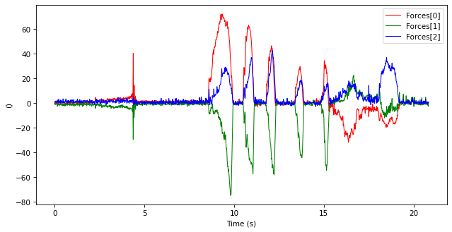
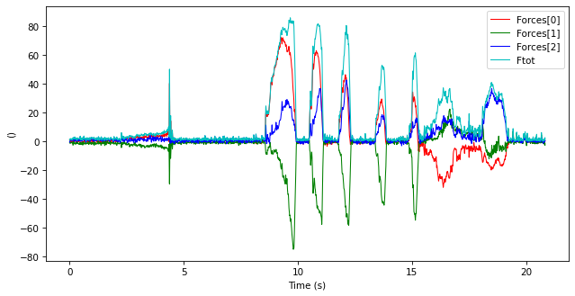
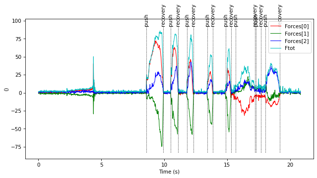
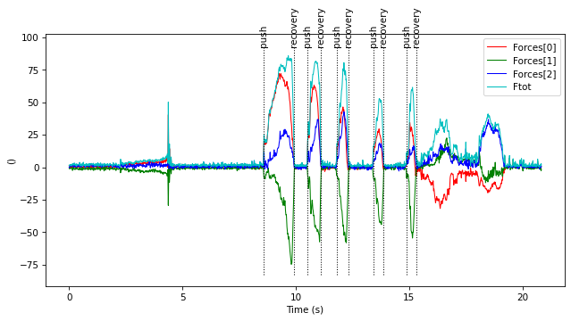

cycles
======

The `cycles` module allows detecting cycles in TimeSeries, time-normalize these cycles and select the most repeatable ones.

!!!warning
    This module is experimental. Function names, signatures and implementations may change anytime.

In this tutorial, we will load kinetics data from wheelchair propulsion using a csv file, and then extract the cycles in these data.


```python
import ktk
import pandas as pd
import numpy as np

# Load the csv file
df = pd.read_csv('data/timeseries/smartwheel.csv',
                 usecols=[18, 19, 20, 21, 22, 23],
                 names=['Forces[0]', 'Forces[1]', 'Forces[2]',
                        'Moments[0]', 'Moments[1]', 'Moments[2]'],
                 nrows=5000)

# Assign time to the DataFrame's index, where the sampling rate is 240 Hz.
df.index = np.arange(df.shape[0]) / 240

# Convert this DataFrame to a TimeSeries
ts = ktk.TimeSeries.from_dataframe(df)
```

At this point, we have a TimeSeries that contains forces and moments.


```python
ts.plot('Forces')
```





To automatically detect the cycles in these data, we will add a third data, the total force, and use thresholds on this new data.


```python
ts.data['Ftot'] = np.sqrt(np.sum(ts.data['Forces'] ** 2, 1))
ts.plot(['Forces', 'Ftot'])
```





Now let see how detecting cycles works. We will define the threshold values visually based on the figure above.


```python
test = ktk.cycles.find_cycles(
    ts, 'Ftot',
    event_names=('push', 'recovery'),
    thresholds=(10, 5))
test.plot(['Forces', 'Ftot'])
```


We observe that several cycles were wrongly detected during the first spike (that is a synchronization spike and not a push). We can reject those cycles by specifying a minimal length for the push phase.


```python
test = ktk.cycles.find_cycles(
    ts, 'Ftot',
    event_names=('push', 'recovery'),
    thresholds=(10, 5),
    minimum_length=0.1)
test.plot(['Forces', 'Ftot'])
```





We also see that the detected cycles at the end are erratic and include pushes that should be excluded. We can exclude these pushes by specifying a minimal value for the push phase.


```python
test = ktk.cycles.find_cycles(
    ts, 'Ftot',
    event_names=('push', 'recovery'),
    thresholds=(10, 5),
    minimum_length=0.1,
    minimum_height=50)
test.plot(['Forces', 'Ftot'])
```





```python

```
